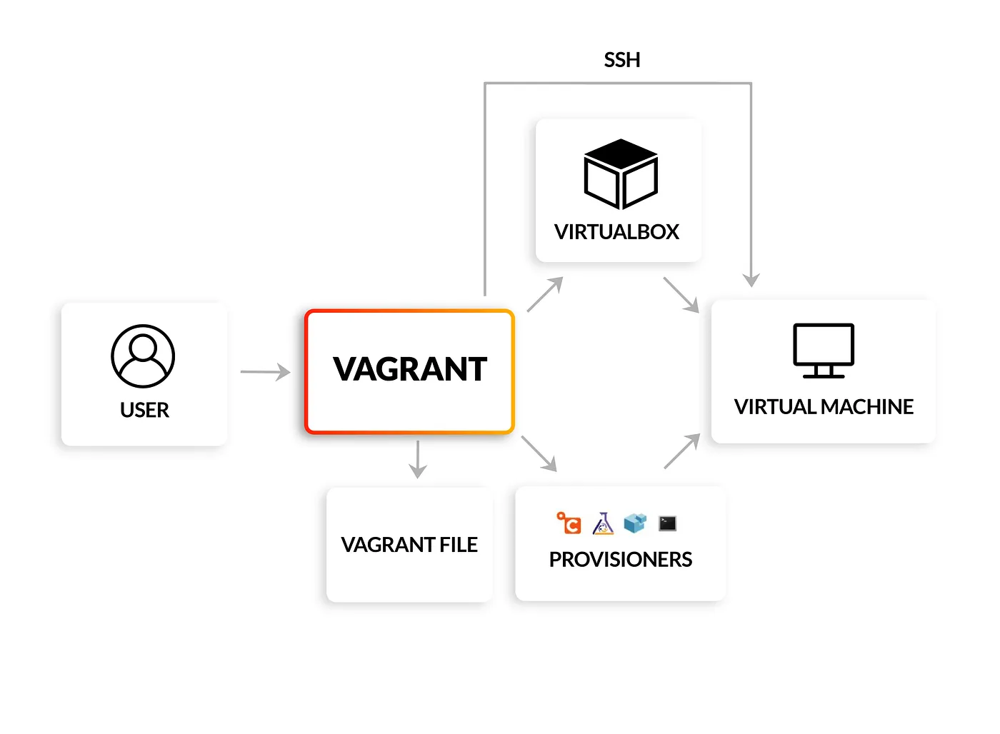
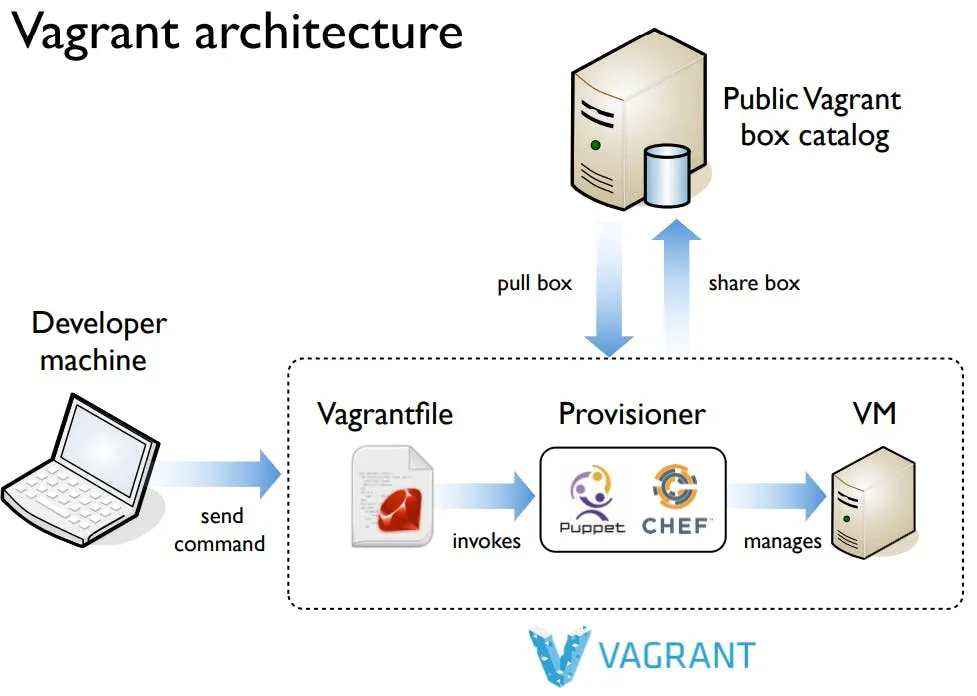

# Inception_of_Things-IoT-
This project aims to introduce you to kubernetes from a developer perspective. You will have to set up small clusters and discover the mechanics of continuous integration. At the end of this project you will be able to have a working cluster in docker and have a usable continuous integration for your applications. 

## Vagrant Docs:

* install a box: *vagrant box add hashicorp/bionic64*
* initialize vagrant : *vagrant init hashicorp/bionic64*
* start the VM: *vagrant up*
* connect to the machine : *vagrant shh (default)*
* disconnect from the machine: *logout*
* list boxes: *vagrant box list*
* destroy the machine: *vagrant destroy*
* remove a box: *vagrant box remove hashicorp/bionic64*
* *Vagrant Share* (HTTP Sharing, SSH Sharing, General Sharing) (needs Ngrok)
* Suspending the virtual machine will stop it and save its current running state: *vagrant suspend*
* gracefully shut down the guest operating system and power down the guest machine: *vagrant halt*
* reload the environement: *vagrant reload*

## Vagrant provisioning:



Provisioning is the process of setting up the software and configuration on a VM or server automatically. In the context of Vagrant, provisioning can include:

* Installing necessary software (e.g., web servers like Apache or Nginx, databases like MySQL or PostgreSQL, programming languages, etc.).
* Configuring the operating system (e.g., setting environment variables, user permissions, network settings).
* Deploying code or running scripts to set up a working development environment.

1. *Shell Script Provisioner*: You can write bash scripts or any shell script and Vagrant will run them to install and configure software:

```ruby
config.vm.provision "shell", inline: <<-SHELL
  sudo apt-get update
  sudo apt-get install -y apache2
SHELL
```

2. *Ansible*: A provisioning tool that uses playbooks (scripts written in YAML) to configure the environment:

```ruby
config.vm.provision "ansible" do |ansible|
  ansible.playbook = "playbook.yml"
end
```

3. *Puppet*: A configuration management tool that Vagrant can use to apply configurations:

```ruby
config.vm.provision "puppet" do |puppet|
  puppet.manifests_path = "manifests"
  puppet.manifest_file  = "default.pp"
end
```

4. *Chef*: Another configuration management tool supported by Vagrant:

```ruby
config.vm.provision "chef_solo" do |chef|
  chef.add_recipe "nginx"
end
```

* https://developer.hashicorp.com/vagrant/tutorials/networking-provisioning-operations/getting-started-provisioning

## Vagrant networking:

```ruby
Vagrant.configure("2") do |config|
  config.vm.box = "hashicorp/bionic64"
  config.vm.provision :shell, path: "bootstrap.sh"
  config.vm.network :forwarded_port, guest: 80, host: 4567
end
```

```markdown
### Explanation of `fechS` Replacing `config` in Vagrant Configuration

In your Vagrant configuration, this line:

```ruby
config.vm.define "fech-chaS" do |fechS|
```

defines a virtual machine (VM) named `"fech-chaS"`. The block that follows allows you to specify configuration options for this particular VM. Inside the block, `fechS` is a variable that refers to the configuration object for the `"fech-chaS"` VM.

### Why `config` Gets "Replaced" by `fechS`:

1. **`config` is the main object** that holds all the configuration for the entire Vagrant environment.
2. When you define a specific VM using `config.vm.define`, you're **creating a scoped configuration** for that particular VM.
3. Inside the block, `fechS` is just a **local alias** for the scoped configuration of that specific VM (`"fech-chaS"` in this case).
4. This allows you to configure options for `"fech-chaS"` using `fechS`, while still leaving `config` available for other global or VM-specific configurations.

### Key Takeaway

`fechS.vm.box = "ubuntu/jammy64"` is setting the box for the `"fech-chaS"` VM, **not replacing `config`**. Instead, `fechS` is simply a shorter reference to the configuration object for that particular VM within the block.

In Vagrant, the network interfaces of the virtual machines (VMs) are named similarly to how they are named in Linux systems, such as `eth0`, `eth1`, etc. These represent the different network adapters connected to the VM.

Here's a breakdown of what the `eth1` interface typically represents in Vagrant:

- **`eth0` (first network interface)**: This is usually configured as the NAT (Network Address Translation) interface by default. It allows the VM to connect to the host system's network (or the internet) but does not provide direct access from the host to the VM. This is often the primary interface.

- **`eth1` (second network interface)**: This is typically used when you configure additional networking options, such as **host-only** or **bridged networking**. In most Vagrant setups, when you specify a private or public network, Vagrant adds another network interface (like `eth1`) to handle this.

### Common configurations for `eth1`:
- **Private network (host-only)**: This is used to set up a private network between your host machine and the VM. You can access the VM directly from your host via a specified IP address.
  
  ```ruby
  config.vm.network "private_network", ip: "192.168.50.4"
  ```

- **Bridged network**: This connects the VM directly to your physical network, allowing it to have its own IP address and act as a standalone device on the network.
  
  ```ruby
  config.vm.network "public_network"
  ```

In summary, `eth1` generally refers to the secondary network interface in a Vagrant VM, which is often used for custom network configurations like private or bridged networks.

https://developer.hashicorp.com/vagrant/tutorials/networking-provisioning-operations/getting-started-networking
https://8grams.medium.com/vagrant-create-modern-development-environments-1978a067fdb3

## Vagrant course:
* creating a fully functional, ssh enabled ubuntu machine:
*vagrant init bento/ubuntu-16.04*
*vagrant up --provider virtualbox*

## vagrant tutorials
https://developer.hashicorp.com/vagrant/docs/cli/ssh
https://developer.hashicorp.com/vagrant/tutorials
multimachine: https://developer.hashicorp.com/vagrant/docs/multi-machine

## k8s vs k3s
https://www.civo.com/blog/k8s-vs-k3s
https://spacelift.io/blog/kubernetes